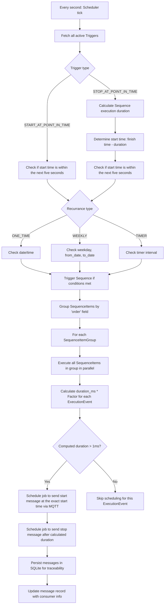

## Entities
### BusinessObjects
- ExecutionEvent
- ExecutionEventGroup
- Trigger
- Sequence
- SequenceItem
- Factor
- User

#### ExecutionEvent (Valve)

Attributes:
- id: string (primary key)
- name: string
- status: enum [ON, OFF]
- duration_ms: integer (default: 10 min)
- activated: boolean (default: True)
- start_event_attributes: object map (string key -> string value, default `{}`)
- stop_event_attributes: object map (string key -> string value, default `{}`)
- execution_event_groups: relationship to ExecutionEventGroup
- factors: relationship to Factors

Input Validations:
- duration_ms must be positive
- start_event_attributes and stop_event_attributes must be JSON objects
- custom attribute keys must be non-empty strings
- custom attribute values must not be null (stored as string)
- the status should only be read not written by the api.
- status is maintained by backend runtime logic:
    - START actions set status to `ON`
    - STOP actions set status to `OFF`
    - on backend startup all ExecutionEvent statuses are reset to `OFF`

#### ExecutionEventGroup (ValveGroup)

Attributes:
- id: string (primary key)
- name: string
- status: enum [ON, OFF] (derived runtime field)
- execution_events: relationship to ExecutionEvents

Input Validations:
- name must not be empty
- id must be unique
- status is read-only via normal create/update payloads and is controlled by runtime start/stop logic

#### Trigger

Attributes:
- id: string (primary key)
- name: string
- date: date (optional)
- time: time (optional)
- weekdays: list of days (optional) day: enum [SU, MO, TU, WE, TH, FR, SA]
- from_date: date (optional)
- to_date: date (optional)
- activated: boolean (default: True)
- recurring: boolean (default: True)
- trigger_type: enum [START_AT_POINT_IN_TIME, STOP_AT_POINT_IN_TIME]
- recurrance_type: enum [TIMER, ONE_TIME, WEEKLY]
- sequences: relationship to Sequences

Input Validations:
- If recurrance_type is ONE_TIME, date must be provided and time for the point in time to start during the day
- If recurrance_type is WEEKLY, weekdays must be provided and time for the point in time to start during the day
- If recurrance_type is TIMER, time must be provided
- If recurrance_type is TIMER, recurring determines whether trigger stays active after the first scheduling
- recurrance_type cannot be changed via update request
- weekdays: list of days must be one or some of [SU, MO, TU, WE, TH, FR, SA]

#### SequenceItem

Attributes:
- id: string (auto-generated if omitted)
- order: integer
- sequence: relationship to Sequence
- execution_event: relationship to ExecutionEvent (optional)
- execution_event_group: relationship to ExecutionEventGroup (optional)

Input Validations:
- execution_event_id or execution_event_group_id must be provided
- order is mandatory

#### Sequence

Attributes:
- id: string
- name
- sequence_items: relation to SequenceItems
- automatically_created: boolean (default false)
- triggers: relations to Triggers

Input Validations:
- the sequence_items cannot be changed via api update request when automatically_created is true 

#### Factors

Attributes:
- id: string (primary key)
- name: string
- factor: float
- activated: boolean (default: True)
- execution_events: relationship to ExecutionOrders
- min_val: float (optional)
- max_val: float (optional)

Input Validations:
- factor must be between 0.0 and the maximum Python float value (`sys.float_info.max`)
- the value `factor` must be between min_val and max_val

#### User

Attributes:
- id
- username
- password_hash
- confirmed: boolean (default: false)

Input Validations:
- username must be unique
- first created user is automatically confirmed if there is no user in the database

### Technical Objects:

#### MqttMessage

Attributes:
- timestamp: date_time
- message_id: string
- entity_id: string
- message: string
- consumers: string

Input Validations:
- cannot be edited via api at all

## Architecture

### Technologies
- minimal message broker: Mosquitto
- TimeMachine Python Flask Backend with Web API to maintain Entities(ExecutionEvent, Trigger, Sequence, Factors) and and MQTT Event interface to send start and stop messages for ExecutionEvents and receive ack events as well as receiving values for Factors(the entity)
    - central config file
- SqLite build into the Backend to store the entity states
- Vue.js Frontend to view and maintain Entities and and manually start and stop ExecutionEvents
    - central config file

## Functional logic

### API

#### General description
- For All entities except user there should be endpoints to get, getAll, find/typeahead(if name attribute exists), create, update and delete. 
- Delete Endpoints should typically validate for foreign key constrains and report them back as response, if a deletion is therefor not possible.
- create endpoints genuinly receive an id from the request. If that id already exists and validationError is returned.
- update endpoints genuinly receive an id from the request. if that id is missing a validationError is returned.
- names are always mandatory as well.
- genuinly all foreign keys/relationships need to be evaluated for existence, otherwise validationError

#### Abbreviation for Entity User
- For the Entity User there is a little more to it, as the password is not supposed to be stored as is but as hash. This is to support basic auth.
- Endpoints:
    - `POST /api/users`: open registration endpoint to create user (`confirmed=false` by default, except the very first user which is auto-confirmed)
    - `GET /api/users`: list all users with their `confirmed` status
    - `POST /api/users/{id}/confirm`: confirm a user
    - `POST /api/users/change_password`: change password for the currently logged in user
- `POST /api/users/change_password` details:
    - requires Basic Auth for an authenticated and confirmed user
    - request payload: `{ "old_password": "...", "new_password": "..." }`
    - validates old password against the current user
    - persists a new password hash and returns `{ "message": "ok" }` on success

#### Abbreviation for Entity Factor
- the attribute factor should have its own endpoint for manipulation: updateFactor(id, value) and should not be included in the normal add/update request.
- activation should be changed only via dedicated endpoints:
    - `POST /api/factors/{id}/activate`
    - `POST /api/factors/{id}/deactivate`
- `activated` is not allowed in factor create/update payloads.

#### Abbreviation for Entity Trigger
- activation should be changed only via dedicated endpoints:
    - `POST /api/triggers/{id}/activate`
    - `POST /api/triggers/{id}/deactivate`
- `activated` is not allowed in trigger create/update payloads.

#### Abbreviation for Entity ExecutionOrder
- there should be additional endpoints to start and stop an ExecutionOrder, manually, as override.
- `POST /api/execution-events/{id}/start` sets the ExecutionEvent status to `ON`.
- `POST /api/execution-events/{id}/stop` sets the ExecutionEvent status to `OFF`.

#### Abbreviation for Entity ExecutionOrderGroup
- there should be additional endpoints to start and stop all ExecutionOrders by ExecutionOrderGroup, manually, as override.

#### Abbreviation for Entity SequenceItem and Sequence
- There is no need for endpoints for a SequenceItem. They are supposed to be included in the Sequence save request.
- If an SequenceItem is removed from a Sequence via a Sequence update request then it should be removed from the db as well.
- `GET /api/sequences/{id}` includes a `runtime` object with scheduler state:
    - `is_running`: `true` if at least one ExecutionEvent is currently running for this Sequence.
    - `running_execution_event_ids`: currently running ExecutionEvent ids.
    - `pending_start_jobs`: number of scheduled future START jobs for this Sequence.
    - `pending_stop_jobs`: number of scheduled future STOP jobs for this Sequence.
- `POST /api/sequences/{id}/start` starts a Sequence manually:
    - uses the same scheduling logic as trigger-based execution.
    - schedules SequenceItems from "now" (respecting ordering and parallel groups).
- `POST /api/sequences/{id}/stop` stops a running Sequence manually:
    - publishes STOP for currently running ExecutionEvents of this Sequence.
    - removes all pending START and STOP jobs for subsequent ExecutionEvents of this Sequence.

#### Error and Validation handling
- Validations genuenly apply as in entity list above.
- messages should follow the standart {"error":"validationError","message":"something... is not allowed"} or {"error":"unexpectedError","message":"some Exception... produced an internal server error"}

### Authentication

#### Basic Auth

- All endpoints should be secured with basic auth.
- `POST /api/users` is open to allow user self-registration.
- In addition a login endpoint should be provided.
- Only logged in and confirmed users are allowed to call restricted endpoints besides the login endpoint.
- User management endpoints (`GET /api/users`, `POST /api/users/{id}/confirm`, `POST /api/users/change_password`) require authenticated and confirmed users.
- Via the config `BASIC_AUTH_ENABLED` it can be globally activated or deactivated.

## Deployment additions

- Backend API URL prefix is configurable via `API_URL_PREFIX` (default `/api`).
- This allows prefixed deployments behind one shared nginx host/port (for example `/tima/api`).
- CORS path matching follows the configured `API_URL_PREFIX`.

## Event Interface

### ExecutionEvents messages

#### Producer
- for ExecutionEvents there should be one ordered topic for both start and stop messages. 
    - Each message should contain 
        - a message id
        - a current_timestamp
        - The ExecutionEvent id
        - The ExecutionEvent name
        - action-specific custom attributes from `start_event_attributes` (for `START`) or `stop_event_attributes` (for `STOP`) as top-level key/value pairs
    - Each message should be persisted in the SQLite db for tracability for a configurable(global config file) amount of time.

#### Consumer
- there should be a topic that is being consumed that is to receive optional acknowledge messages.
    - example:
        - a message id
        - a consumer identifier
    - when received the message record in the sqlite db is updated with those information.
        - there could be several consumers in the future. The different consumers should be stored as comma separated list in the same row of this message. No need to create an additional table.

### Factor messages

#### Producer
- there should be a (if possible compacted) topic to produce Factor message when they are saved(added or updated)
containing:
    - message id
    - Factor id
    - Factor name

## Change notes
- App naming is standardized to `TiMa`/`tima` in backend defaults.
- Updated defaults include app name, auth realm, SQLite file name, MQTT client id, and MQTT topic prefixes.
- deleted messages should be produced if the Factor is being deleted. 
containing:
    - message id
    - Factor id

#### Consumer
- there should be a topic where Values (field `factor`) for the existing Factors are being provided from externally. Those message are expected to contain:
    - Factor id
    - value as float

### User Interaction
#### ExecutionEvents and ExecutionEventGroups
- The user can create ExecutionEvents and group them in ExecutionEventGroups. 
    - the `duration_ms` is supposed to when the ExecutionOrder is stopped after it has been started in ms.
    - via the `activated` field the ExecutionOrder can be activated and deactivated. Meaning if set to false ExecutionOrders can not be triggered inside a Sequence only via the manual override Endpoint.
    - When an ExecutionEvent or ExecutionEventGroup is created, a Sequence is also automatically created with on SequenceItem reflecting the ExecutionEvent or ExecutionEventGroup. 
        - The name of that Sequence is '${(ExecutionEvent|ExecutionEventGroup).name}_default_sequence'
        - The order of the SequenceItem should always be 1.
        - The name of the automatically created Sequence changes accordingly if the name of the ExecutionEvent|ExecutionEventGroup changes
        - the field `automatically_created` the automatically created Sequence is set to true
    - If a ExecutionEvent is deleted, they are automatically removed from ExecutionEventGroups without error.
    - If an ExecutionEvent or ExecutionEventGroup is being deleted the automatically created 

#### Sequences and SequenceItems
- The user can create Sequences that contain 0 to n SequenceItems. 
    - The order value of an SequenceItem is not unique. If several SequenceItems have the same order, that means they are supposed to be executed in parallel
    - One SequenceItem wraps either an ExecutionEvent or ExecutionEventGroup, cannot be null.
    - If an ExecutionEvent or ExecutionEventGroup is being deleted all related SequenceItems are supposed to be deleted as well.
    - If a Sequence is deleted, All SequenceItems are deleted as well.

#### Trigger
- The user can create Trigger 
    - for several different use cases (`trigger_type`) :
        - START_AT_POINT_IN_TIME: The Trigger is supposed to start a Sequence at certain point in time
        - STOP_AT_POINT_IN_TIME: The Trigger is supposed to start a Sequence at a computed point in time to finish at a certain point in time
    - the `recurrance_type` of a Trigger can be:
        - WEEKLY: a list of `weekdays` is provided on which the Sequence is supposed to be executed
            - in addition a `from_date` and a `to_date` can be set to restrict the execution to a timespan of a year.
        - ONE_TIME: the sequence is just supposed to be executed once at the given `date`
        - TIMER: After a Trigger is saved, the Sequence is supposed to be executed after the provided `time` has passed. The timeStamp of saving should be captured in the `date` field
            - if `recurring` is false, the Trigger is deactivated after the first scheduling
    - a Trigger can be activated or deactivated via dedicated endpoints (`POST /api/triggers/{id}/activate`, `POST /api/triggers/{id}/deactivate`). Meaning, when deactivated (`activated`=false) the Sequence(s) related to the Trigger are not supposed to be triggered for execution by this very Trigger.
    - ONE_TIME Triggers are automatically deactivated after they have been scheduled once.
    - Trigger update supports `stop_sequences=true`:
        - all currently running related Sequences are stopped (STOP sent for running ExecutionEvents)
        - all pending START/STOP jobs for those Sequences are removed
        - if `sequence_ids` are changed in the same update request, both old and new related Sequences are considered

#### Factor
- A user can create a Factor
    - with just a name and min or max values
    - activation/deactivation is done via dedicated endpoints (`POST /api/factors/{id}/activate`, `POST /api/factors/{id}/deactivate`)
    - The value `factor` of this Factor is supposed to be provided via another BuildingBlock per mqtt message of api call.
    - The value `factor` is supposed to be multiplied with the duration_ms of the related ExecutionEvents when it comes to the scheduling logic
    

### Scheduling logic 

APScheduler to be used for scheduling start and stop messages.

**Notes:**
- The scheduler checks all triggers every second.
- For `STOP_AT_POINT_IN_TIME`, the total execution duration is calculated by summing up all SequenceItems, considering Factors for each ExecutionEvent (or ExecutionEvents in ExecutionEventGroups).
- The start time is computed so the Sequence finishes exactly at the specified time.
- Sequences are executed either in parallel or serial, based on SequenceItem order.
- All start/stop actions are sent via MQTT and persisted in the database.
- ExecutionEvents with computed duration <= 1ms are skipped and no start/stop jobs are scheduled for them.
- Factor values dynamically affect the execution duration.
- Acknowledgement messages from consumers update the persisted records.

